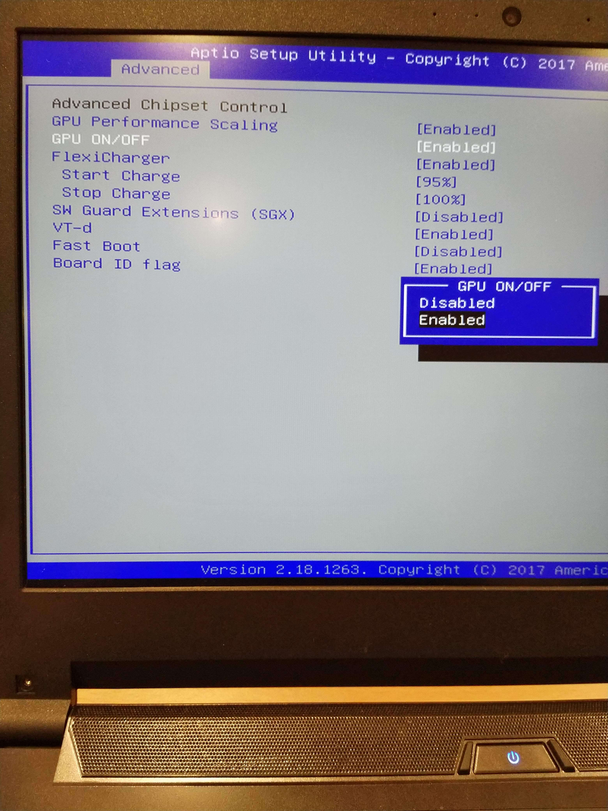

# starlabs-cuda

Before beginning, disable the Nvidia GPU in the BIOS by booting the computer whilst tapping F2.
Use the arrow keys to navigate to the second tab at the top, select 'Advanced'.


Under 'Advanced Chipset Control', use the arrow keys select "Disabled" under "GPU ON/OFF".


### Remove previous install
Remove all existing Nvidia files with the below command
```
sudo apt purge *nvidia*
```


### Install dependancies
```
sudo apt install build-essential libelf-dev
```


### Blacklist Nouveau
```
echo Blacklisting nouveau$'\n'blacklist nouveau$'\n'blacklist lbm-nouveau$'\n'alias nouveau off$'\n'alias lbm-nouveau off$'\n'options nouveau modeset=0 | sudo tee -a /etc/modprobe.d/blacklist.conf

sed -i 's/Blacklisting nouveau/# Blacklisting nouveau/'g /etc/modprobe.d/blacklist.conf

sudo update-initramfs -u -k all

sudo systemctl mask gpu-manager.service
```

### Download CUDA
```
wget https://developer.nvidia.com/compute/cuda/10.0/Prod/local_installers/cuda_10.0.130_410.48_linux
```


### Extract CUDA
```
sudo chmod +x cuda_10.0.130_410.48_linux

mkdir ~/Downloads/cuda-extracted/

sh cuda_10.0.130_410.48_linux --extract=~/Downloads/cuda-extracted/
```

### Enable GPU
Go back to the BIOS and renable the GPU

### Install Nvidia driver
```
sudo sh NVIDIA-Linux-x86_64-410.48.run --no-opengl-files --no-drm
```

### Disable GPU
Go back to the BIOS and disable the GPU

### Install CUDA
```
sudo sh cuda-linux.10.0.130-24817639.run
```

### Enable GPU
Go back to the BIOS and enable the GPU

